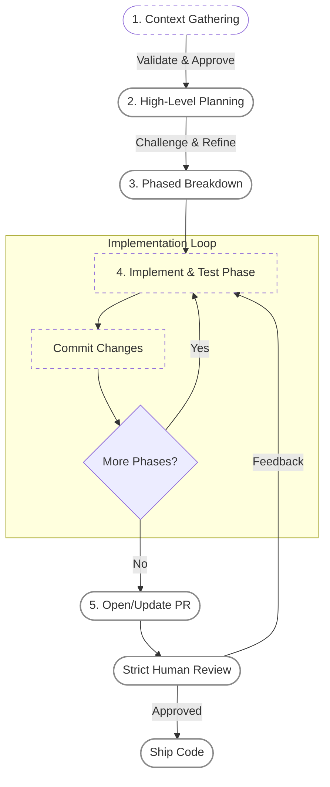
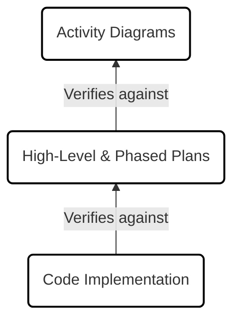

## What AI Breaks

What's happening right now with AI in software engineering feels very similar to previous shifts in abstraction, though much more extreme. We moved from low-level programming to high-level languages, then to frameworks, and now we're moving to a level where we don't even write most of the implementation ourselves anymore.

The difference this time is fundamental. Previous abstractions were deterministic and structured. AI is probabilistic and unstructured.

You can ask an LLM anything in natural language, and it will give you something that looks entirely reasonable. Looking reasonable, however, does not mean it is correct or appropriate for your specific system. The core issue is not that AI is a bad tool — it's that we lost the rigid structure that used to enforce good engineering practices. We now need to reintroduce it ourselves.

But structure is not the only casualty. There is a subtler, more dangerous one: the erosion of the team's understanding of its own codebase. Addy Osmani named this [Comprehension Debt](https://addyosmani.com/blog/comprehension-debt/) — the growing gap between how much code exists in a system and how much of it any human genuinely understands. Unlike technical debt, which announces itself through friction, comprehension debt hides behind working software. Tests pass, CI is green, but nobody on the team can explain why things work or what breaks when conditions change.

AI accelerates this gap. Code is now generated faster than developers can absorb it. The traditional feedback loop — where writing code forced understanding — is broken. This does not mean engineers need to understand every line of implementation. That was already unrealistic before AI. What matters is maintaining **architectural comprehension**: how the system is organized, what the key technical decisions were, how data flows, and where the boundaries sit. Lose that, and you lose the ability to make good decisions about the system — which is the one thing AI cannot do for you.

## Two Wrong Responses

As developers navigate this shift, they consistently fall into one of two traps. They either blindly trust AI, or they avoid it completely. Both are wrong.

### The Blind Truster
AI does not optimize for your system. It optimizes for statistical likelihood given incomplete context. It produces the most common solution — fine in a vacuum, rarely right for a complex system.

Worse, AI rarely asks for missing context. If it lacks information, it fills the gaps with something plausible. You end up with code that looks correct but is subtly wrong. The blind truster generates code faster than they can read it, outsources their understanding to the machine, and eventually builds a fragile system they can no longer debug or maintain. This is comprehension debt in its purest form — shipped fast, understood by no one.

### The Complete Avoider
If you write everything manually, you are constrained by your typing speed and mental stamina. AI clears the mechanical work so you can save your mental energy for the architectural work. Without it, engineers often avoid necessary refactors because they simply take too long.

The avoider protects their deep understanding but moves at a glacial pace, burning cognitive energy on boilerplate and getting outpaced by teams using AI responsibly to amplify their output.

### The Gap
The blind truster has speed but no understanding. The avoider has understanding but no speed. The answer is in between: use AI for the mechanical execution while keeping human ownership of the decisions and the understanding.

## The Principle: AI as an Implementation Engine

**AI should be treated as an implementation engine.** It executes, explores, and drafts. The human owns the system — decides what to build, how to structure it, and what trade-offs to make. The AI realizes those decisions faster.

To make this work, you cannot just "use AI." You have to design the interaction around specific constraints:

1.  **Context Isolation (Control the Blast Radius):** AI hallucinates when overwhelmed by irrelevant information. Context must be curated, validated, and tightly bounded before any code is written.
2.  **Human Agency in Architecture:** All high-level decisions (system design, library choices, data modeling) belong strictly to the human. The AI is a sounding board, not the architect.
3.  **Small Batch Execution:** Large, monolithic PRs generated by AI are impossible to review. Execution must be broken down into single, logical units of change.
4.  **Trust Through Verification:** Treat AI output like code from an incredibly fast, somewhat reckless junior developer. You verify the contract (tests and diagrams) before you read the implementation.

## The Workflow

Here is the 5-step blueprint that puts these principles into practice.

### Session Management

Before diving into the steps, one critical tactical decision: **never keep one continuous chat session for a feature.** The context window gets polluted with old brainstorms, discarded ideas, and irrelevant code, causing the model to degrade in quality.

* **The "Thinker" Session (Heavy Models):** A fresh session dedicated to Steps 1, 2, and 3 (Context Gathering, High-Level Plan, Phased Plan). I use the smartest model available here because reasoning and architecture are paramount.
* **The "Doer" Session (Fast/Coding Models):** Once the phased plan is locked, I either compact the context or start an entirely new session for implementation.
* **State Management via Git:** If a feature is complex, I start a *fresh context for every single phase*. To prevent the AI from losing track of what was just built, I instruct the agent to check `git history` to read the code changes from previous phases. This allows the AI to "catch up" instantly using the actual source of truth (the codebase) rather than a bloated chat history.

I also define consistent formats for every artifact. A context document, a high-level plan, and a phased breakdown each follow a reusable template. Without this, the model invents a different structure every time, making outputs harder to review and compare across features.

### Step 1: Context is Everything
An agent with the wrong context is useless. Most AI failures I've encountered trace back to this — the model confidently built on an incorrect understanding of the system.

In a fresh session, instead of jumping straight into implementation, I explicitly ask the AI to reconstruct the relevant part of the codebase. I have it search related files, trace logic, and document how things currently work into a structured document. Then I validate it. This usually takes a couple of iterations, but it prevents far more expensive rework downstream.

### Step 2: High-Level Planning
Once the context is solid, I ask the AI to draft a high-level plan for the feature. I do not give it my own solution upfront. This avoids biasing the model and lets me see what it would naturally propose.

I review the plan, challenge it, ask about trade-offs, and compare it with my own ideas. We iterate until we converge. At this stage, all high-level decisions are made by me.

### Step 3: Phased Breakdown
I then break the approved plan down into smaller phases, where **each phase corresponds to a single commit.** Each commit represents one logical unit of change (introducing a type, using it, refactoring, removing dead code). I do not mix concerns. The AI produces a detailed phased plan describing each step clearly.

### Step 4: Iterative Implementation & The Testing Contract
This is where Session Management kicks in. I either compact the context or start a new "Doer" session. The AI tackles the plan one phase at a time.

For each phase:
1. The AI writes the code.
2. It updates or adds tests, ensuring everything passes (the contract).
3. It commits the changes with a clear title and detailed description.
4. If working across fresh sessions, the AI checks `git history` to ground itself before starting the next phase.

If the interface is correct and the tests reflect the intended behavior, I do not always need to read every single line of the implementation at this exact moment.

### Step 5: Pull Requests and Non-Negotiable Review
Once the loop is complete, the AI opens a PR. I make sure the PR includes the earlier artifacts (context doc, plans) as collapsed sections to give any reviewer full visibility.

Then comes the non-negotiable step: **I review everything.** I go through commits one by one. I check the code, verify the tests, and ensure alignment with the plan. If something feels off, I leave comments and send the AI back into the implementation loop.

#### Hierarchical Understanding
A key technique during review: lean on diagrams. I ask the AI to generate activity diagrams or high-level flowcharts.

These diagrams act as a compressed view of the implementation. I can quickly see the flow and detect if something is fundamentally wrong before diving into the code. Once the diagram looks right, I verify the code matches the diagram.

This is how I keep comprehension debt in check. I do not need to hold every implementation detail in my head. I verify the architecture, the flow, and the decisions — the level of understanding that matters for making good calls about the system going forward. The workflow produces artifacts (context docs, plans, diagrams, tests) that preserve this understanding beyond the person who wrote the code, which is what makes it sustainable on a team.

## The Cost of Skipping This

There are trade-offs to this approach. It feels slower upfront. There is overhead in writing plans, validating context, and managing sessions. For larger features, however, it becomes significantly faster overall. It prevents rework, bugs, and confusion later. Most failures I've seen happen when I skip steps or fail to clear a polluted context window.

The alternative is worse. If you let AI generate code without discipline, you quickly end up in a negative feedback loop: a messy codebase makes the AI worse at reasoning about the system, which produces messier code, which degrades the AI's effectiveness further. Humans can sometimes navigate inconsistent systems by inferring intent. AI cannot. It relies on patterns and local consistency — and once those erode, the tool that was supposed to make you faster starts actively working against you. This is comprehension debt compounding into technical debt, and it is the most expensive failure mode in AI-assisted development.

AI does not remove the need for good engineering practices. It makes the lack of discipline much more dangerous. The real opportunity is elevating engineers to focus on design, constraints, and reasoning while the AI handles execution. To make this work, we need to be intentional, structured, and strictly responsible for the systems we build. Otherwise, we are just generating legacy code faster than ever before.
