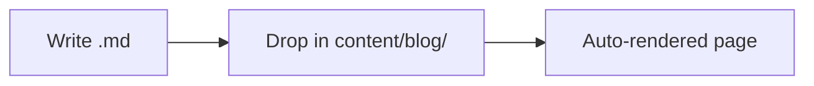

Welcome to my blog! Here's what this system supports.

## Code Highlighting

```typescript
function greet(name: string): string {
  return `Hello, ${name}!`;
}
```

```python
def fibonacci(n: int) -> list[int]:
    a, b = 0, 1
    result = []
    for _ in range(n):
        result.append(a)
        a, b = b, a + b
    return result
```

## Mermaid Diagrams



## Images

*Place images in `public/blog/hello-world/` and reference them like: ``*

## Videos

*Place videos in `public/blog/hello-world/` and embed them like: `<video src="/blog/hello-world/demo.mp4" controls />`*

## Tables

| Feature | Supported |
|---------|-----------|
| Code    | Yes       |
| Mermaid | Yes       |
| Tables  | Yes       |
| Images  | Yes       |
| Videos  | Yes       |

## Blockquotes

> This is a blockquote. It can span multiple lines and supports **bold** and *italic* text.

## Task Lists

- [x] Set up blog infrastructure
- [x] Write first post
- [ ] Add more content
