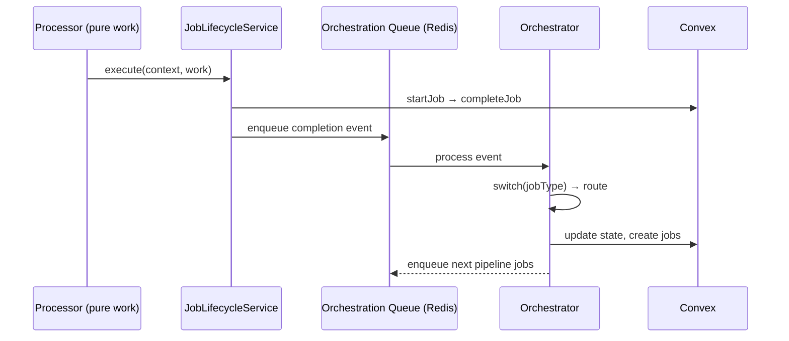
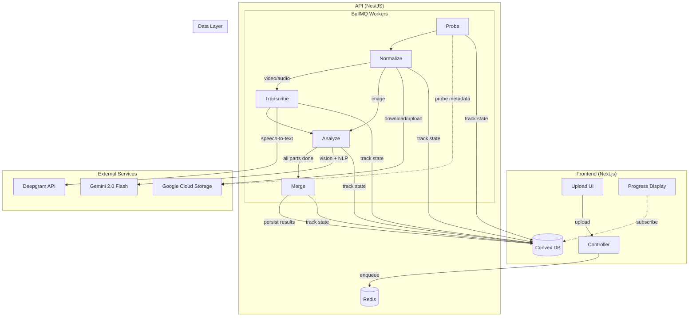
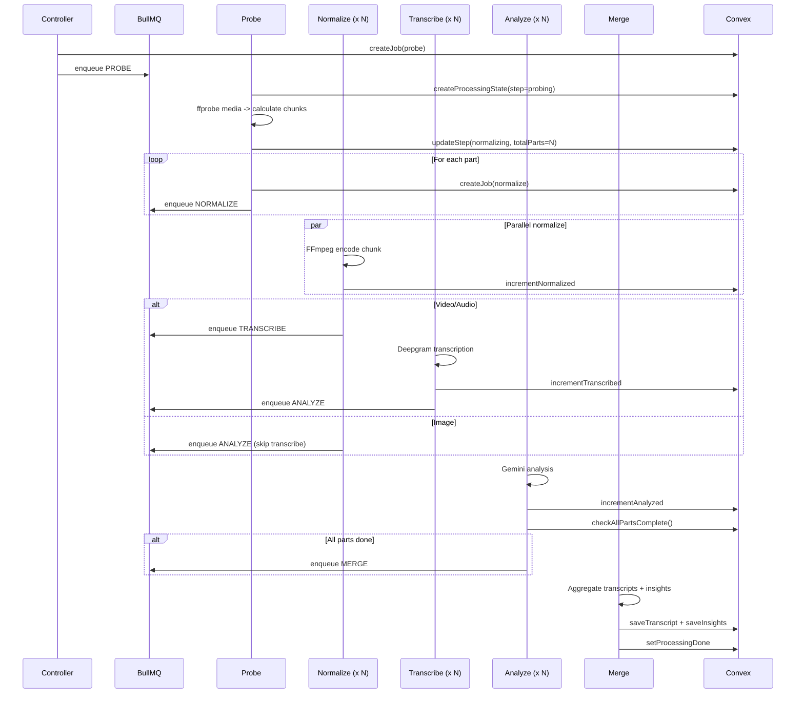
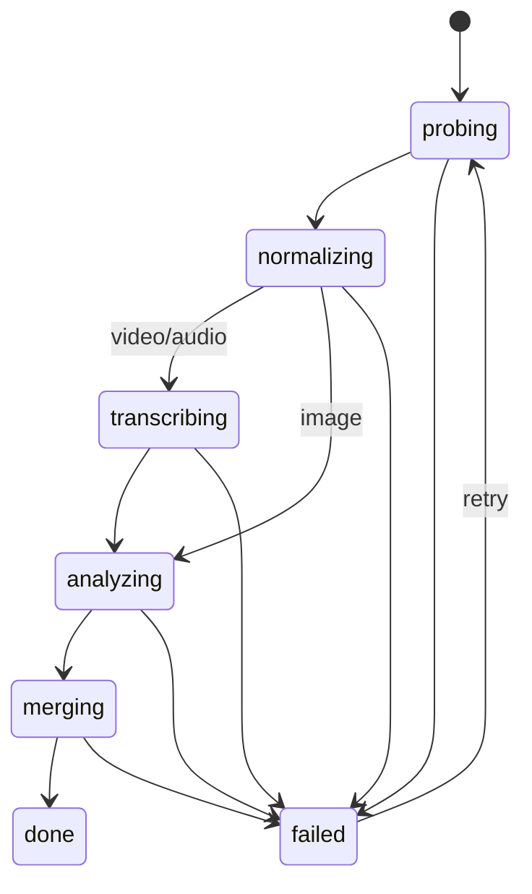
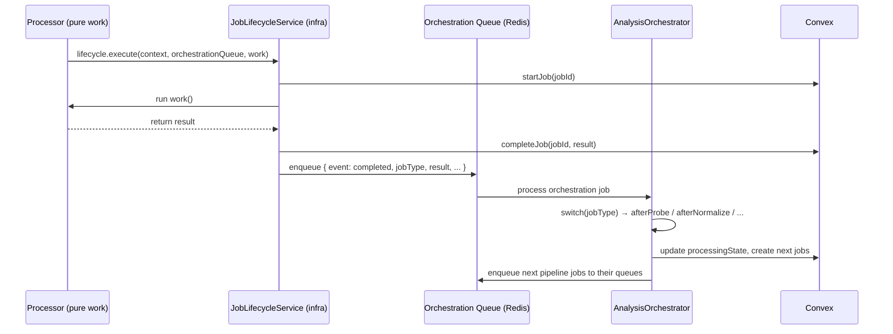

## Summary

- Introduce an **orchestrator pattern** for the analysis pipeline — a single `AnalysisOrchestrator` processor on a dedicated BullMQ orchestration queue that owns ALL scheduling decisions
- Create **pure processors** (probe, normalize, transcribe, analyze, merge) that only do their core work — no scheduling, no state management, no counter increments
- Extract **generic job infra** (`JobLifecycleService`, `JobContext`, `ORCHESTRATION_QUEUE` token, orchestration event types) into `libs/server/infra` for reuse by any workflow
- Create **`libs/server/workflows`** library containing analysis processors, orchestrator, pipeline functions, and all analysis types/constants
- Add **architecture README** explaining how to create new workflows on this infra

## Key architecture changes

- **Cross-machine orchestration** via a dedicated BullMQ queue (not in-process EventEmitter)
- **Type-safe job routing** with `WorkflowType` and `AnalysisJobType` enums (no string matching)
- **Zero queue boilerplate in processors** — `JobLifecycleService` owns the orchestration queue via DI (`JobLifecycleModule.forQueue()`), processors just call `lifecycle.execute(context, work)` and `lifecycle.reportExhausted(event)`
- **Dependency direction**: `workflows` and `infra` never import from `agent-runtime`
- **Entire pipeline traceable from one file**: `analysis.orchestrator.ts`



## New library structure

```
libs/server/infra/src/queues/
├── job-events.ts               # ORCHESTRATION_QUEUE token, WorkflowType, event interfaces
├── job-lifecycle.service.ts    # execute(context, work) + reportExhausted()
├── job-lifecycle.module.ts     # forQueue(name) dynamic module
└── error-classification.ts     # transient/permanent/unknown

libs/server/workflows/src/analysis/
├── analysis.orchestrator.ts    # ALL routing: afterProbe/Normalize/Transcribe/Analyze/Merge
├── analysis.constants.ts       # AnalysisJobType enum, queue names, configs
├── analysis.types.ts           # Job I/O interfaces
├── analysis-workflow.module.ts # NestJS module wiring
├── processors/                 # Pure: data in → result out
│   ├── probe.processor.ts
│   ├── normalize.processor.ts
│   ├── transcribe.processor.ts
│   ├── analyze.processor.ts
│   └── merge.processor.ts
└── functions/                  # Shared business logic
    ├── media-probe.ts, transcription.ts, analyzer.ts,
    ├── analysis-merger.ts, post-processing.ts, format-transcript.ts
    └── ffmpeg-binary-paths.ts, temp-paths.ts, genai-loader.ts
```

## Commits (12)

1. `3c557e90` — Add orchestration event types and `WorkflowType` enum to infra
2. `31180de0` — Move `JobLifecycleService` to `libs/server/infra`
3. `38e1aeff` — Enhance `JobLifecycleService` with orchestration queue routing
4. `15dcb4f0` — Create `libs/server/workflows` with `AnalysisJobType` enum, constants, types
5. `78570902` — Move analysis pipeline functions from agent-runtime to workflows
6. `2e6b61d9` — Create pure analysis processors in workflows
7. `3752ab32` — Create `AnalysisOrchestrator` with all routing logic
8. `bc11efa8` — Create `AnalysisWorkflowModule` and wire into API app
9. `68995a5d` — Delete old processors, module, and backward-compat re-exports
10. `e4fab056` — Remove legacy `execute()` overload from `JobLifecycleService`
11. `208c2864` — Inject orchestration queue into `JobLifecycleService` via DI token, clean all processors
12. `a747c780` — Add architecture README for the team

## Test plan

- [ ] `pnpm nx build api` succeeds
- [ ] `pnpm nx build server-workflows` succeeds
- [ ] `pnpm nx build server-infra` succeeds
- [ ] `pnpm nx build agent-runtime` succeeds
- [ ] `pnpm nx test server-workflows` — 37 tests pass
- [ ] `pnpm nx test server-infra` — 25 tests pass
- [ ] Upload asset → probe → normalize → transcribe → analyze → merge → done

## Planning .MD files used in this PR


<details>

<summary>1. Old architecture documentation</summary>

# Job Processing Architecture & Analysis Pipeline

## Executive Summary

ReelCut processes media assets (video, audio, image) through a multi-stage analysis pipeline that extracts transcripts, AI-powered insights, scene detection, and moment identification. The system uses **BullMQ** (backed by Redis) for job orchestration and **Convex** for real-time state tracking, enabling the frontend to display live progress.

**Core problem:** Media analysis is IO/network-bound (FFmpeg encoding, Deepgram transcription, Gemini vision analysis) and must handle large files by chunking them into parts processed in parallel.

**Inputs:** Raw media file (uploaded to GCS) + project/asset metadata
**Outputs:** Structured transcript (word-level captions + paragraphs), AI insights (scenes, mood, themes, moments), silence detection

---

## Architecture & System Flow

### High-Level Architecture



### Pipeline Execution Flow



### Processing States



---

## Relevant Files

```
libs/server/infra/src/
├── queues/
│   ├── analysis-job.types.ts      # Queue names, configs, all job I/O types
│   └── error-classification.ts    # Transient vs permanent error classification
├── convex/
│   ├── convex-client.service.ts   # All Convex mutations/queries (job lifecycle, processing state, transcripts, insights)
│   ├── convex-client.module.ts    # NestJS module wiring
│   └── identity/
│       └── convex-identity-token.service.ts  # RS256 JWT minting for backend auth
└── config/
    └── config.service.ts          # Typed env config (API keys, Redis URL, GCS, etc.)

libs/shared/convex/src/lib/
├── schema.ts                      # jobs + processingState table definitions
├── jobs.ts                        # Job CRUD mutations/queries
├── processingState.ts             # Processing state mutations/queries + readiness aggregation
├── validators.ts                  # Shared validators (ProcessingStep, jobStatus, etc.)
├── transcript.ts                  # Transcript persistence
├── insights.ts                    # Insights persistence
└── normalizedParts.ts             # Normalized chunk metadata persistence

libs/server/agent-runtime/src/lib/
├── media-normalizer.ts            # ffprobe + FFmpeg encoding + chunk calculation
├── transcription.ts               # Deepgram transcription wrapper
├── agents/analyzer.agent.ts       # Gemini analysis (video/audio/image dispatching)
├── analysis-merger.ts             # Multi-part result aggregation
├── post-processing.ts             # Silence detection + moments builder
└── utils/format-transcript.ts     # Transcript -> Gemini-ready text formatting

apps/api/src/app/
├── queues/
│   ├── analysis-queues.module.ts  # BullMQ module registration (5 queues + processors)
│   ├── job-lifecycle.service.ts   # start -> execute -> complete/fail wrapper
│   └── processors/
│       ├── probe.processor.ts
│       ├── normalize.processor.ts
│       ├── transcribe.processor.ts
│       ├── analyze.processor.ts
│       └── merge.processor.ts
└── agents/services/
    ├── asset-analysis.controller.ts    # POST /run-analysis, /retry-analysis
    └── convex-asset-store.service.ts   # Auto-triggers probe on asset upload
```

---

## Implementation Details

### Queue Configuration

Each queue has tuned concurrency and retry settings defined in `analysis-job.types.ts`:

| Queue | Concurrency | Attempts | Backoff |
|-------|-------------|----------|---------|
| PROBE | 5 | 2 | 2s exponential |
| NORMALIZE | 3 | 2 | 2s exponential |
| TRANSCRIBE | 5 | 3 | 3s exponential |
| ANALYZE | 3 | 3 | 5s exponential |
| MERGE | 3 | 2 | 1s exponential |

PROBE and TRANSCRIBE are higher concurrency because they're mostly waiting on I/O (ffprobe over HTTP, Deepgram API). NORMALIZE and ANALYZE are lower because they're heavier (FFmpeg CPU, Gemini rate limits).

### Job Grouping & Correlation

All jobs for a single asset share a `groupId` of format `analysis:{projectId}:{assetId}`. This enables:
- Fetching all jobs for an asset (retry, cleanup)
- Atomic merge readiness check (`checkAllPartsComplete` queries by group)
- Parent-child relationships via `parentJobId` for traceability

### Dual State Tracking

**Jobs table** — low-level task records with full input/result history, status lifecycle (queued -> running -> completed/failed), and error classification.

**ProcessingState table** — high-level per-asset progress the frontend subscribes to. Tracks current step, part counters (partsNormalized, partsTranscribed, partsAnalyzed), and aggregates into project-level readiness.

This separation keeps the UI reactive (single document subscription) while preserving full job audit history.

### Chunking Strategy

The probe processor splits media into ~15-minute chunks (`targetChunkDuration = 900s`). Each chunk becomes an independent normalize -> transcribe -> analyze pipeline. The merge processor reassembles results, applying `startOffset` to all timestamps so they reference the original media timeline.

Images are single-part (no chunking) and skip transcription entirely.

### Processor Pattern

Every processor follows the same structure:

```typescript
@Processor(QUEUE_NAME, { concurrency: CONFIG.concurrency })
class XxxProcessor extends WorkerHost {
  // Main work — BullMQ calls this
  async process(job: Job<XxxInput>): Promise<XxxResult> {
    return this.jobLifecycle.execute(convexJobId, async () => {
      // 1. Do work (download, encode, call API, etc.)
      // 2. Update processing state counters
      // 3. Enqueue next stage
      return result;
    });
  }

  // Called when retries exhausted — marks asset as permanently failed
  @OnWorkerEvent("failed")
  async onFailed(job: Job | undefined, error: Error): Promise<void> {
    if (!job || job.attemptsMade < (job.opts.attempts ?? 1)) return;
    await this.convex.setProcessingFailed(projectId, assetId, message, stepName);
  }
}
```

`JobLifecycleService.execute()` wraps the work with: `startJob()` -> run work -> `completeJob(result)` or `failJob(error, category)`. Errors are classified as transient/permanent via pattern matching and re-thrown so BullMQ applies its retry policy.

### Merge Completion Gate

The analyze processor checks merge readiness **after** its own job is marked complete in Convex. `checkAllPartsComplete()` is an atomic Convex mutation that:
1. Counts completed analyze jobs (and transcribe jobs if required)
2. If all parts done and no merge job exists yet -> returns `"enqueue_merge"`
3. If merge already exists -> returns `"already_exists"` (prevents duplicate merges)
4. Otherwise -> returns `"not_ready"`

### Backend Authentication

The API authenticates with Convex using RS256 JWTs minted by `ConvexIdentityTokenService`. Backend-only Convex mutations (jobs, processingState writes) verify the token issuer contains `"reelcut-api"` via `requireBackendAuth()`, preventing direct client calls.

### Analysis Providers

- **FFprobe** — media metadata extraction (duration, dimensions, fps, audio presence)
- **FFmpeg** — normalization encoding (H.264 480p for video, MP3 128k for audio, JPEG for images)
- **Deepgram** — `nova-2` model with diarization and paragraph segmentation
- **Gemini 2.0 Flash** — vision + NLP analysis with Zod-validated JSON output schemas per asset type

---

## Edge Cases, Error Handling & Limitations

### Error Classification

`error-classification.ts` pattern-matches error messages into categories:
- **Transient** (retryable): rate limits, timeouts, network errors, 503/429
- **Permanent** (non-retryable): unsupported formats, corrupt files, 400/404
- **Unknown**: everything else (treated as retryable by default)

### Normalize Caching

If a normalize job runs for a part that already has a `normalizedPart` record in Convex (from a previous attempt), it skips encoding and reuses the cached GCS path. Still enqueues the next stage to maintain pipeline flow.

### Retry Flow

`POST /retry-analysis` fetches all failed jobs in a group, resets their status to queued, resets `processingState` to probing, and re-enqueues each job with its original configuration. This restarts the entire pipeline for the asset.

### Known Limitations

- **`input`/`result` fields in jobs table use `v.any()`** — loses Convex-level type safety. Job I/O types are defined as TypeScript interfaces in `analysis-job.types.ts` but aren't expressed as Convex validators.
- **Merge processor hardcodes `gemini-2.0-flash`** as provider/model metadata. Future multi-provider support would need to propagate the model choice through the pipeline.
- **No dead-letter queue** — failed jobs stay in the jobs table with `status: "failed"`. Cleanup relies on manual retry or the `markedForCleanup` flag set by the merge processor.
- **Single Redis instance** — no sentinel/cluster configuration. Redis failure stops all job processing.


</details>


<details>

<summary>2. New Approach Phased Plan</summary>

# Phased Implementation Plan: Workflow Orchestrator Refactor

The analysis pipeline (probe → normalize → transcribe → analyze → merge) scatters scheduling logic across 5 processors. Each processor decides what job runs next, updates processing state, increments counters, and enqueues downstream jobs — making it impossible to trace the workflow from a single location.

This refactor introduces:

1. **Orchestrator pattern** — a single orchestrator per workflow owns all scheduling decisions
2. **Dumb processors** — pure input→output, no scheduling or state management
3. **Cross-machine orchestration** — via a dedicated BullMQ orchestration queue (not in-process EventEmitter)
4. **Generic job infra in `libs/server/infra`** — `JobLifecycleService`, event types, reusable by any server
5. **New `libs/server/workflows`** — processors, orchestrator, and pipeline functions co-located

### Key Design Decisions

**Cross-machine orchestration via orchestration queue (not EventEmitter).**
NestJS `EventEmitter` is in-process only — it won't work if processors and orchestrator run on different machines. Instead, when a job completes, `JobLifecycleService` enqueues a completion event to a dedicated **orchestration queue** (BullMQ, Redis-backed). The orchestrator is a `@Processor` on that queue — same primitives, works across machines, retries if orchestrator crashes.

```
Processor completes → lifecycle enqueues to orchestration queue → Orchestrator processes event → routes + schedules next job
```

**Type-safe job routing with enums (no string matching).**
Instead of `groupId.startsWith('analysis:')`, job data carries a typed `workflowType: WorkflowType` field. Instead of `jobType: string`, use `AnalysisJobType` enum. Both are single-source-of-truth enums exported from their respective libraries.

**Dependency direction: workflows owns all analysis code.**
`probeMedia`, `calculateChunkOffsets`, and all other pipeline functions move to workflows. `libs/server/workflows` and `libs/server/infra` NEVER import `libs/server/agent-runtime`. The reverse is fine if needed.

### Architecture After Refactor




### Library Structure

```
libs/server/infra/src/queues/
├── job-lifecycle.service.ts    # Enhanced: accepts JobContext + orchestration Queue
├── job-lifecycle.module.ts     # NestJS module
├── job-events.ts               # JobContext, OrchestrationEvent, WorkflowType enum
└── error-classification.ts     # Unchanged

libs/server/workflows/src/analysis/
├── analysis.orchestrator.ts     # @Processor on orchestration queue — ALL routing
├── analysis.constants.ts        # AnalysisJobType enum, queue names, configs
├── analysis.types.ts            # Job I/O types (ProbeInput/Result, etc.)
├── analysis-workflow.module.ts  # Registers queues + processors + orchestrator
├── processors/
│   ├── probe.processor.ts       # Pure: probeMedia → ProbeResult
│   ├── normalize.processor.ts   # Pure: FFmpeg encode → NormalizeResult
│   ├── transcribe.processor.ts  # Pure: Deepgram → TranscribeResult
│   ├── analyze.processor.ts     # Pure: Gemini → AnalyzeResult
│   └── merge.processor.ts       # Pure: merge parts → MergeResult
└── functions/
    ├── media-probe.ts           # probeMedia, calculateChunkOffsets
    ├── transcription.ts         # transcribeAsset (Deepgram)
    ├── analyzer.ts              # analyzeAsset (Gemini)
    ├── analysis-merger.ts       # AnalysisMerger.merge()
    ├── post-processing.ts       # detectSilences, buildMomentsFromScenes/Paragraphs
    └── format-transcript.ts     # formatTranscriptForGemini
```

---

## Phase 1: Add job orchestration event types and enums to infra

- **Goal**: Introduce the generic type foundations (`JobContext`, `WorkflowType`, orchestration event interfaces) that all subsequent phases build on.
- **Steps**:
  - Create `libs/server/infra/src/queues/job-events.ts`:
    ```typescript
    export enum WorkflowType {
      ANALYSIS = 'analysis',
    }

    export interface JobContext {
      jobId: string;       // Convex job ID
      jobType: string;     // Workflow-specific (e.g., AnalysisJobType.PROBE)
      workflowType: WorkflowType;
      groupId: string;
      input: Record<string, unknown>;
    }

    export interface OrchestrationEvent {
      event: 'completed' | 'exhausted';
      jobType: string;
      workflowType: WorkflowType;
      groupId: string;
      input: Record<string, unknown>;
    }

    export interface JobCompletedEvent extends OrchestrationEvent {
      event: 'completed';
      jobId: string;
      result: Record<string, unknown>;
    }

    export interface JobExhaustedEvent extends OrchestrationEvent {
      event: 'exhausted';
      error: string;
    }
    ```
  - Export from `libs/server/infra/src/index.ts`
- **Validation**: `pnpm nx build server-infra`

## Phase 2: Move JobLifecycleService to infra with existing API

- **Goal**: Relocate `JobLifecycleService` from `apps/api` to `libs/server/infra` so any server can reuse it. Keep the current API unchanged — enhancement comes next phase.
- **Steps**:
  - Copy `apps/api/src/app/queues/job-lifecycle.service.ts` → `libs/server/infra/src/queues/job-lifecycle.service.ts`
  - Create `libs/server/infra/src/queues/job-lifecycle.module.ts` (NestJS module providing + exporting the service)
  - Export from `libs/server/infra/src/index.ts`
  - Replace `apps/api/src/app/queues/job-lifecycle.service.ts` body with a re-export shim: `export { JobLifecycleService } from '@reelcut/server-infra';`
  - Update `apps/api/src/app/queues/analysis-queues.module.ts` to import `JobLifecycleModule` from infra
- **Validation**: `pnpm nx build server-infra && pnpm nx build api && pnpm nx test api`

## Phase 3: Enhance JobLifecycleService with orchestration queue routing

- **Goal**: Expand `execute()` to accept `JobContext` and an orchestration `Queue`, then enqueue completion/failure events to that queue after Convex state transitions. Old overload preserved for backward compat during migration.
- **Steps**:
  - Add overloaded signature to `JobLifecycleService`:
    ```typescript
    // New signature
    async execute<TResult>(
      context: JobContext,
      completionQueue: Queue,
      work: () => Promise<TResult>,
    ): Promise<TResult>

    // Old signature (deprecated, for migration)
    async execute<TResult>(
      jobId: Id<"jobs">,
      work: () => Promise<TResult>,
    ): Promise<TResult>
    ```
  - In the new overload, after `convex.completeJob()`:
    ```typescript
    await completionQueue.add('completed', {
      event: 'completed',
      workflowType: context.workflowType,
      jobType: context.jobType,
      groupId: context.groupId,
      jobId: context.jobId,
      input: context.input,
      result: result as Record<string, unknown>,
    } satisfies JobCompletedEvent);
    ```
  - On failure (before re-throw), do NOT enqueue — BullMQ may retry. Exhaustion is handled separately by each processor's `@OnWorkerEvent('failed')`.
- **Validation**: `pnpm nx build server-infra && pnpm nx build api`

## Phase 4: Create workflows library with analysis job enums, constants, and types

- **Goal**: Scaffold `libs/server/workflows` and populate it with the single-source-of-truth `AnalysisJobType` enum, queue names/configs, orchestration queue constant, and all job I/O types.
- **Steps**:
  - `pnpm nx generate @nx/js:library server-workflows --directory=libs/server/workflows --importPath=@reelcut/server-workflows --bundler=tsc`
  - Create `libs/server/workflows/src/analysis/analysis.constants.ts`:
    ```typescript
    export enum AnalysisJobType {
      PROBE = 'probe',
      NORMALIZE = 'normalize',
      TRANSCRIBE = 'transcribe',
      ANALYZE = 'analyze',
      MERGE = 'merge',
    }

    export const ANALYSIS_QUEUES = { ... };            // queue name strings
    export const ANALYSIS_QUEUE_CONFIG = { ... };      // concurrency, attempts, backoff per queue
    export const ANALYSIS_ORCHESTRATION_QUEUE = 'analysis-orchestration';
    ```
  - Create `libs/server/workflows/src/analysis/analysis.types.ts` — move all job I/O interfaces (`ProbeInput`, `ProbeResult`, `NormalizeInput`, etc.) from `libs/server/infra/src/queues/analysis-job.types.ts`
  - Update `libs/server/infra/src/queues/analysis-job.types.ts` to re-export from `@reelcut/server-workflows` (backward compat for existing consumers in `apps/api`)
  - Create directory stubs: `analysis/processors/`, `analysis/functions/`
  - Export from `libs/server/workflows/src/index.ts`
- **Validation**: `pnpm nx build server-workflows && pnpm nx build server-infra && pnpm nx build api`

## Phase 5: Move analysis pipeline functions to workflows

- **Goal**: Relocate all analysis pipeline functions from `agent-runtime` to `libs/server/workflows/src/analysis/functions/`. This includes `probeMedia`/`calculateChunkOffsets` (per requirement: workflows/infra must NOT import agent-runtime).
- **Steps**:
  - Move files (update internal imports as needed):
    - `agent-runtime/src/lib/media-normalizer.ts` → `workflows/src/analysis/functions/media-probe.ts` (extract `probeMedia`, `calculateChunkOffsets`, and supporting types/helpers; leave normalize functions behind if still needed, or move all)
    - `agent-runtime/src/lib/transcription.ts` → `workflows/src/analysis/functions/transcription.ts`
    - `agent-runtime/src/lib/agents/analyzer.agent.ts` → `workflows/src/analysis/functions/analyzer.ts`
    - `agent-runtime/src/lib/analysis-merger.ts` → `workflows/src/analysis/functions/analysis-merger.ts`
    - `agent-runtime/src/lib/post-processing.ts` → `workflows/src/analysis/functions/post-processing.ts`
    - `agent-runtime/src/lib/utils/format-transcript.ts` → `workflows/src/analysis/functions/format-transcript.ts`
  - Move utility files needed by these functions that can't remain in agent-runtime (since workflows can't import from agent-runtime):
    - `ffmpeg-binary-paths.ts` → `workflows/src/analysis/functions/` (used by media-probe)
    - `temp-paths.ts` → `libs/server/infra/src/` (generic utility, used by normalize + transcribe processors)
  - Move associated test files alongside their source
  - Update `agent-runtime/src/server.ts` — replace moved exports with re-exports from `@reelcut/server-workflows` (backward compat for old processors still in apps/api)
  - Export from `libs/server/workflows/src/index.ts`
- **Validation**: `pnpm nx build server-workflows && pnpm nx build agent-runtime && pnpm nx build api && pnpm nx test server-workflows`

## Phase 6: Create pure analysis processors in workflows

- **Goal**: Write all 5 processors as pure input→output units — they call `lifecycle.execute()` with the orchestration queue and do only their core work. No scheduling, no state updates, no counter increments.
- **Steps**:
  - Create 5 files in `libs/server/workflows/src/analysis/processors/`
  - Each processor follows this pattern:
    ```typescript
    @Processor(ANALYSIS_QUEUES.PROBE, { concurrency: ANALYSIS_QUEUE_CONFIG[ANALYSIS_QUEUES.PROBE].concurrency })
    export class ProbeProcessor extends WorkerHost {
      constructor(
        private readonly lifecycle: JobLifecycleService,
        private readonly gcs: GcsClient,
        @InjectQueue(ANALYSIS_ORCHESTRATION_QUEUE) private readonly orchestrationQueue: Queue,
      ) { super(); }

      async process(job: Job<ProbeJobData>): Promise<ProbeResult> {
        const context: JobContext = {
          jobId: job.data.convexJobId,
          jobType: AnalysisJobType.PROBE,
          workflowType: WorkflowType.ANALYSIS,
          groupId: job.data.groupId,
          input: job.data,
        };
        return this.lifecycle.execute(context, this.orchestrationQueue, async () => {
          // Pure probe work — return result, nothing else
        });
      }

      @OnWorkerEvent('failed')
      async onFailed(job: Job<ProbeJobData> | undefined, error: Error): Promise<void> {
        if (!job || job.attemptsMade < (job.opts.attempts ?? 1)) return;
        await this.orchestrationQueue.add('exhausted', {
          event: 'exhausted',
          workflowType: WorkflowType.ANALYSIS,
          jobType: AnalysisJobType.PROBE,
          groupId: job.data.groupId,
          input: job.data,
          error: errorMessage(error),
        } satisfies JobExhaustedEvent);
      }
    }
    ```
  - **What processors DO**: probe media, encode chunks, call Deepgram, call Gemini, merge results
  - **What processors DON'T DO**: create next jobs, update processing state steps, increment counters, check completion gates, persist transcripts/insights
  - These files exist but are NOT registered in any NestJS module yet — the old processors still handle jobs
- **Validation**: `pnpm nx build server-workflows`

## Phase 7: Create analysis orchestrator

- **Goal**: Write the single `AnalysisOrchestrator` — a `@Processor` on the orchestration queue that contains ALL scheduling, state transition, and persistence logic for the analysis workflow.
- **Steps**:
  - Create `libs/server/workflows/src/analysis/analysis.orchestrator.ts`:
    ```typescript
    @Processor(ANALYSIS_ORCHESTRATION_QUEUE, { concurrency: 10 })
    export class AnalysisOrchestrator extends WorkerHost {
      constructor(
        private readonly convex: ConvexClientService,
        @InjectQueue(ANALYSIS_QUEUES.NORMALIZE) private normalizeQueue: Queue,
        @InjectQueue(ANALYSIS_QUEUES.TRANSCRIBE) private transcribeQueue: Queue,
        @InjectQueue(ANALYSIS_QUEUES.ANALYZE) private analyzeQueue: Queue,
        @InjectQueue(ANALYSIS_QUEUES.MERGE) private mergeQueue: Queue,
      ) { super(); }

      async process(job: Job<OrchestrationEvent>): Promise<void> {
        if (job.data.event === 'completed') {
          const event = job.data as JobCompletedEvent;
          switch (event.jobType) {
            case AnalysisJobType.PROBE:      return this.afterProbe(event);
            case AnalysisJobType.NORMALIZE:  return this.afterNormalize(event);
            case AnalysisJobType.TRANSCRIBE: return this.afterTranscribe(event);
            case AnalysisJobType.ANALYZE:    return this.afterAnalyze(event);
            case AnalysisJobType.MERGE:      return this.afterMerge(event);
          }
        } else if (job.data.event === 'exhausted') {
          return this.onExhausted(job.data as JobExhaustedEvent);
        }
      }

      // Entry point — called by controller/store
      async startAnalysis(projectId: string, assets: AssetInput[]): Promise<void>

      // Each method contains the orchestration logic currently in that processor:
      private async afterProbe(e): Promise<void>      // createProcessingState, enqueue N normalize
      private async afterNormalize(e): Promise<void>   // increment counter, branch transcribe/analyze
      private async afterTranscribe(e): Promise<void>  // increment counter, enqueue analyze with transcript
      private async afterAnalyze(e): Promise<void>     // increment counter, checkAllPartsComplete, enqueue merge
      private async afterMerge(e): Promise<void>       // persist transcript+insights, setDone, markCleanup
      private async onExhausted(e): Promise<void>      // setProcessingFailed
    }
    ```
  - The logic in each `after*` method is extracted directly from the corresponding old processor (line numbers noted in previous doc)
  - Write tests: `analysis.orchestrator.spec.ts` — mock `ConvexClientService` and downstream queues, verify routing and scheduling decisions for each job type
- **Validation**: `pnpm nx build server-workflows && pnpm nx test server-workflows`

## Phase 8: Create AnalysisWorkflowModule and wire into API app

- **Goal**: Register the new processors, orchestrator, and queues in a NestJS module, then replace `AnalysisQueuesModule` in the API app.
- **Steps**:
  - Create `libs/server/workflows/src/analysis/analysis-workflow.module.ts`:
    ```typescript
    @Module({
      imports: [
        ConfigModule,
        ConvexClientModule,
        BullModule.registerQueue(
          { name: ANALYSIS_QUEUES.PROBE },
          { name: ANALYSIS_QUEUES.NORMALIZE },
          { name: ANALYSIS_QUEUES.TRANSCRIBE },
          { name: ANALYSIS_QUEUES.ANALYZE },
          { name: ANALYSIS_QUEUES.MERGE },
          { name: ANALYSIS_ORCHESTRATION_QUEUE },
        ),
        JobLifecycleModule,
      ],
      providers: [
        ProbeProcessor, NormalizeProcessor, TranscribeProcessor,
        AnalyzeProcessor, MergeProcessor, AnalysisOrchestrator,
      ],
      exports: [BullModule, AnalysisOrchestrator],
    })
    export class AnalysisWorkflowModule {}
    ```
  - Update `apps/api/src/app/app.module.ts`: replace `AnalysisQueuesModule` with `AnalysisWorkflowModule`
  - Update `apps/api/src/app/agents/services/asset-analysis.module.ts`: replace module import
  - Update `apps/api/src/app/agents/services/asset-analysis.controller.ts`:
    - Import `AnalysisJobType`, queue constants from `@reelcut/server-workflows`
    - Optionally refactor to call `orchestrator.startAnalysis()` instead of manual probe enqueue
  - Update `apps/api/src/app/agents/services/convex-asset-store.service.ts`: same import changes
  - Export `AnalysisWorkflowModule` from `libs/server/workflows/src/index.ts`
- **Validation**: `pnpm nx build api && pnpm nx build server-workflows` — full pipeline test: upload asset → probe → normalize → transcribe → analyze → merge → done

## Phase 9: Delete old processors, module, and backward-compat re-exports

- **Goal**: Remove all dead code — old processors, old queues module, lifecycle shim, and temporary re-exports from agent-runtime and infra.
- **Steps**:
  - Delete `apps/api/src/app/queues/` directory entirely (processors, module, lifecycle shim, spec)
  - Update `libs/server/agent-runtime/src/server.ts`: remove re-exports of moved functions (`probeMedia`, `calculateChunkOffsets`, `transcribeAsset`, `analyzeAsset`, `AnalysisMerger`, `detectSilences`, `buildMomentsFromScenes`, `buildMomentsFromParagraphs`, `formatTranscriptForGemini`, `normalizeVideoForAnalysis`, etc.)
  - Delete source files from agent-runtime that were moved in phase 5 (transcription.ts, analyzer.agent.ts, analysis-merger.ts, post-processing.ts, format-transcript.ts, media-normalizer.ts + their specs)
  - Update `libs/server/infra/src/queues/analysis-job.types.ts`: remove file or replace with a note pointing to `@reelcut/server-workflows`
  - Update `libs/server/infra/src/index.ts`: remove analysis-specific re-exports
- **Validation**: `pnpm nx build api && pnpm nx build server-workflows && pnpm nx build server-infra && pnpm nx build agent-runtime && pnpm nx test api && pnpm nx test server-workflows`


</details>
