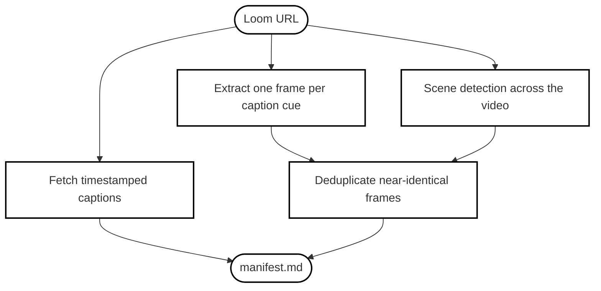

Someone records a Loom of a bug: "When I click this button, the panel disappears." They drop the link in Slack. You paste it to your coding agent and ask it to fix the issue. The agent can't do anything with it. It cannot see the video or hear the narration.

I got tired of manually transcribing Looms into prompts, so I built a skill for it: **loom-watch**. I have been using it pretty frequently since.

```bash
npx skills add mohasarc/mo-skills --skill loom-watch
```

## Why the Transcript Alone Is Not Enough

Loom already generates a transcript, so the obvious fix is to feed that to the agent. It does not work. People narrating their screen do not describe things, they point at them:

> "So when I click this, that section over there breaks."

Strip away the screen and the transcript becomes a series of dangling references. The agent reads "this button" and has no idea which button. The information is not in the audio or the video alone. It is in the alignment between them: what was said, next to what was on screen at that moment.

## What loom-watch Does

You give it a Loom URL, it gives the agent something it can read:

```
tmp/<video-id>/
├── transcript.vtt    # timestamped captions
├── frames/           # PNG screenshots
└── manifest.md       # captions linked to their frames
```

The manifest is the key artifact. Each caption cue points to the frame that was on screen when it was spoken. The agent reads the manifest first, then opens only the frames that matter, and checks references like "this element" against the actual on-screen state instead of guessing from the words.

<div align="center">



</div>

Scene detection is there because caption boundaries miss changes that happen mid-sentence, like a modal opening or an error flashing. Deduplication keeps the output small, since screen recordings are mostly static.

No API key, no Loom account. It uses Loom's public transcript and video endpoints.

## Limitations

- Only works with public or unlisted Looms. Anything behind SSO or a password is inaccessible.
- Needs `ffmpeg` and `python3` on your PATH.
- It relies on undocumented Loom endpoints, so it may break if Loom changes them.

## Try It

```bash
npx skills add mohasarc/mo-skills --skill loom-watch
```

Source is in my skills repo: [github.com/mohasarc/mo-skills](https://github.com/mohasarc/mo-skills/tree/main/skills/loom-watch).
